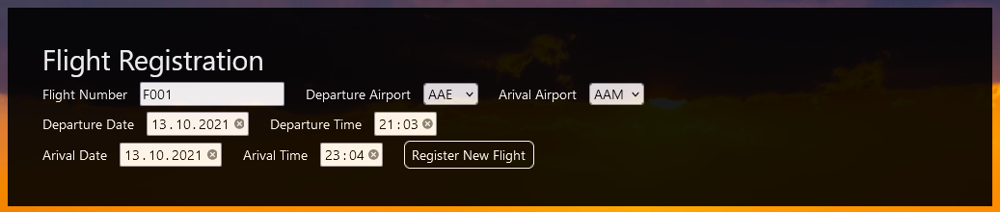
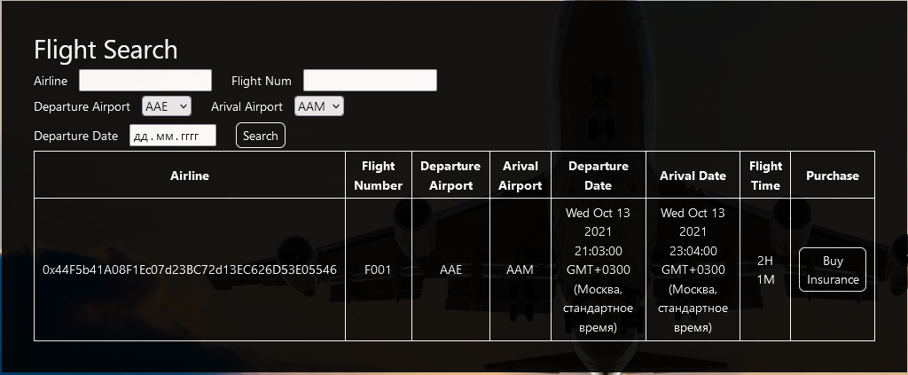
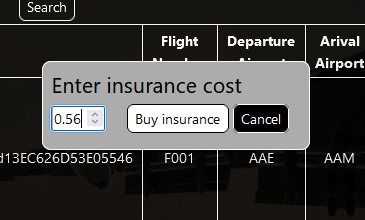
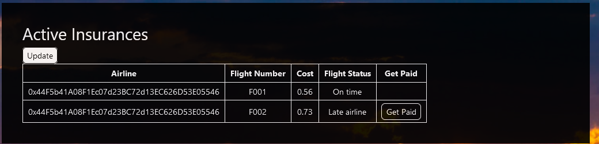

# FlightSurety

FlightSurety is a sample application project for Udacity's Blockchain course.

## Install

This repository contains Smart Contract code in Solidity (using Truffle), tests (also using Truffle), dApp scaffolding (using HTML, CSS and JS) and server app scaffolding.

To install, download or clone the repo, then:

`npm install`
`truffle compile`

## Develop Client

To run truffle tests:

`truffle test ./test/flightSurety.js`
`truffle test ./test/oracles.js`

To use the dapp:

`truffle migrate`
`npm run dapp`

To view dapp:

`http://localhost:8000`

## Develop Server

### Windows
`npm run server-windows`
### Linux 
`npm run server-linux`

`truffle test ./test/oracles.js`

## Deploy

To build dapp for prod:
`npm run dapp:prod`

Deploy the contents of the ./dapp folder

## Aditional information

### Oracles Private keys
Oracles private keys is stored as list in file src/server/oraclesPrivateKeys.json. They have been created by ganache with mnemonic: "leopard harbor cost goddess plug fit muscle retire bundle exact awake escape". (Have been created 50 accounts, last 20 were used as oracles).

### Running test
In order to run tests, you should previously run `ganache-cli -a 30 -e 1000` in another terminal. It is required, because by default truffle run `ganache-cli` with only 10 accounts, which is not enough for oracles testing. 

## Dapp overview

#### Registering flight
If you are active airline, you can register flight with required flight number, date and time.

#### Buying insurance
After flight has been registered, any user can buy insurence for it. First of all he need to query desired flight. 

And after that buy insurance with desired flight.

#### Fetching flight status
If flight is finished(and oracles are ready) you can send oracle request

#### Receiving insurance payments
If flight has been delayed by the company, you would see button "Get Paid" in your active insurances list(after refreshing)

## Resources

* [How does Ethereum work anyway?](https://medium.com/@preethikasireddy/how-does-ethereum-work-anyway-22d1df506369)
* [BIP39 Mnemonic Generator](https://iancoleman.io/bip39/)
* [Truffle Framework](http://truffleframework.com/)
* [Ganache Local Blockchain](http://truffleframework.com/ganache/)
* [Remix Solidity IDE](https://remix.ethereum.org/)
* [Solidity Language Reference](http://solidity.readthedocs.io/en/v0.4.24/)
* [Ethereum Blockchain Explorer](https://etherscan.io/)
* [Web3Js Reference](https://github.com/ethereum/wiki/wiki/JavaScript-API)